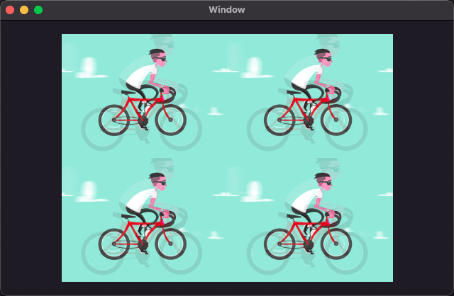
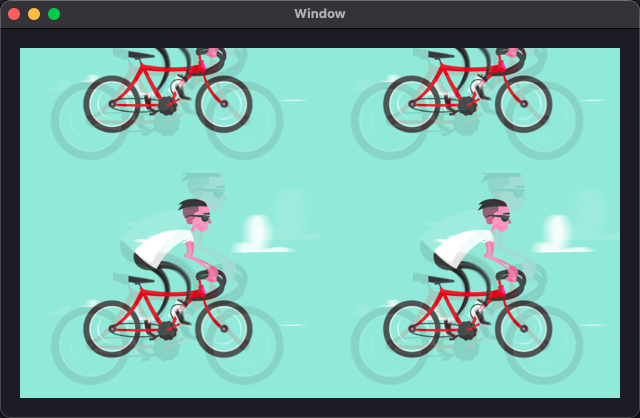

# Wintersweet

<p align="left">

</p>

[](https://github.com/yangKJ/Wintersweet)
[](https://cocoapods.org/pods/Wintersweet)


[**Wintersweet**](https://github.com/yangKJ/Wintersweet) is a library that quickly allows controls to play gifs and add filters. The core is to use CADisplayLink to constantly refresh and update gif frames.

## Features
🧢 At the moment, the most important features of [**GIF Animatable**](https://github.com/yangKJ/Wintersweet) can be summarized as follows:

- Support full platform system，macOS、iOS、tvOS、watchOS.
- Support add [Harbeth](https://github.com/yangKJ/Harbeth) filter to gif.
- Support local and network play gif animated.
- Support any control and used the protocol [AsAnimatable](https://github.com/yangKJ/Wintersweet/blob/master/Sources/AsAnimatable.swift).
- Support six content filling modes.
- Support memory cache network gif data.

------

## Requirements

| iOS Target | macOS Target | Xcode Version | Swift Version |
|:---:|:---:|:---:|:---:|
| iOS 10.0+ | macOS 10.13+ | Xcode 12.4+ | Swift 5.0+ |

## Support the Project
Buy me a coffee or support me on [GitHub](https://github.com/sponsors/yangKJ?frequency=one-time&sponsor=yangKJ).

<a href="https://www.buymeacoffee.com/yangkj3102">

</a>

------

## Used

1. Local gif source.

```
func setup(imageName: String) {
    guard let imagePath = Bundle.main.url(forResource: imageName, withExtension: "gif"),
          let data = try? Data(contentsOf: imagePath) else {
        return
    }
    let filters: [C7FilterProtocol] = [
        C7SoulOut(soul: 0.75),
        C7ColorConvert(with: .rbga),
        C7Storyboard(ranks: 2),
    ]
    imageView.play(withGIFData: data, filters: filters, preparation: {
        // do something..
    })
}
```

2. Network url gif source.

```
func setupNetworkGif() {
    let URL = URL(string: ``URL Link``)!
    animatedView.play(withGIFURL: URL, filters: [
        C7WhiteBalance(temperature: 5555),
        C7LookupTable(image: R.image("lut_x"))
    ], loop: .count(5), cacheOption: Cached.Options.usedMemoryCache)
}
```

3. Any control implementation protocol ``AsAnimatable`` can support gif animated playback.

```
class GIFView: UIView, AsAnimatable {
    
}
```

**GIF animated support has been implemented here for [ImageView](https://github.com/yangKJ/Wintersweet/blob/master/Sources/Extensions/ImageView%2BExt.swift), so you can use it directly.✌️**

### AsAnimatable

- The protocol that view classes need to conform to to enable gif animated support.

```
public protocol AsAnimatable: HasAnimatable {    
    /// Total duration of one animation loop
    var loopDuration: TimeInterval { get }
    
    /// Returns the active frame if available.
    var activeFrame: C7Image? { get }
    
    /// Total frame count of the GIF.
    var frameCount: Int { get }
    
    /// Introspect whether the instance is animating.
    var isAnimatingGIF: Bool { get }
    
    /// Compute frame size for this gif.
    var gifSize: Int { get }
    
    /// Stop animating and free up GIF data from memory.
    func prepareForReuseGIF()
    
    /// Start animating GIF.
    func startAnimatingGIF()
    
    /// Stop animating GIF.
    func stopAnimatingGIF()
}
```

Public two methods to play gif animated:

```
/// Prepare for animation and start play gif.
/// - Parameters:
///   - GIFData: GIF image data.
///   - filters: Wintersweet filters apply to gif frame.
///   - loop: Desired number of loops. Default  is ``forever``.
///   - contentMode: Content mode used for resizing the frames. Default is ``original``.
///   - bufferCount: The number of frames to buffer. Default is 50.
///   - preparation: Ready to play time callback.
///   - animated: Be played GIF.
public func play(withGIFData data: Data,
                 filters: [HFilter],
                 loop: Wintersweet.Loop = .forever,
                 contentMode: Wintersweet.ContentMode = .original,
                 bufferCount: Int = 50,
                 preparation: PreparationCallback? = nil,
                 animated: AnimatedCallback? = nil) {
    ...
}

/// Prepare for animation and start play gif.
/// - Parameters:
///   - GIFURL: GIF image url.
///   - filters: Wintersweet filters apply to gif frame.
///   - loop: Desired number of loops. Default  is ``forever``.
///   - contentMode: Content mode used for resizing the frames. Default is ``original``.
///   - cacheOption: Weather or not we should cache the URL response.
///   - bufferCount: The number of frames to buffer. Default is 50.
///   - preparation: Ready to play time callback.
///   - animated: Be played GIF.
///   - failed: Network failure callback.
public func play(withGIFURL: URL,
                 filters: [HFilter],
                 loop: Wintersweet.Loop = .forever,
                 contentMode: Wintersweet.ContentMode = .original,
                 cacheOption: Wintersweet.Cached.Options = .disableMemoryCache,
                 bufferCount: Int = 50,
                 preparation: PreparationCallback? = nil,
                 animated: AnimatedCallback? = nil,
                 failed: FailedCallback? = nil) {
    ...
}
```

### ContentMode

- Mainly for the image filling content to change the size.

```
/// Mainly for the image filling content to change the size.
public enum ContentMode {
    /// Dimensions of the original image.Do nothing with it.
    case original
    /// The option to scale the content to fit the size of itself by changing the aspect ratio of the content if necessary.
    case scaleToFill
    /// Contents scaled to fit with fixed aspect. remainder is transparent.
    case scaleAspectFit
    /// Contents scaled to fill with fixed aspect. some portion of content may be clipped.
    case scaleAspectFill
    /// Contents scaled to fill with fixed aspect. top or left portion of content may be clipped.
    case scaleAspectBottomRight
    /// Contents scaled to fill with fixed aspect. bottom or right portion of content may be clipped.
    case scaleAspectTopLeft
}
```

| original | scaleToFill | scaleAspectFit |
| --- | --- | --- |
||||

| scaleAspectFill | scaleAspectBottomRight | scaleAspectTopLeft |
| --- | --- | --- |
||||

### Cached

- Network data caching type.

```
/// Disables memory cache reads.
public static let disableMemoryCacheReads = Options(rawValue: 1 << 0)
/// Disables memory cache writes.
public static let disableMemoryCacheWrites = Options(rawValue: 1 << 1)
/// Read and write memory cache.
public static let usedMemoryCache = Options(rawValue: 1 << 2)
/// Disables both memory cache reads and writes.
public static let disableMemoryCache: Options = //
```

### Loop

- Gif animated played count.

```
public enum Loop {
    /// Incessant cycle.
    case forever
    /// Play it once.
    case never
    /// Loop the specified ``count`` times.
    case count(_ count: Int)
}
```

### ImageContainer

- A single property protocol that animatable classes can optionally conform to. 
- Generally, controls with `image` attributes need to implement this protocol.

```
public protocol ImageContainer {
    /// Used for displaying the animation frames.
    var image: C7Image? { get set }
}

extension AsAnimatable where Self: ImageContainer {
    /// Returns the intrinsic content size based on the size of the image.
    public var intrinsicContentSize: CGSize {
        return image?.size ?? CGSize.zero
    }
}
```

## Installation

**CocoaPods**

```ruby
pod 'Wintersweet'
```

**Swift Package Manager**

```swift
dependencies: [
    .package(url: "https://github.com/yangKJ/Wintersweet.git", branch: "master"),
]
```

### Remarks

> The general process is almost like this, the Demo is also written in great detail, you can check it out for yourself.🎷
>
> [**WintersweetDemo**](https://github.com/yangKJ/Wintersweet)
>
> Tip: If you find it helpful, please help me with a star. If you have any questions or needs, you can also issue.
>
> Thanks.🎇

### About the author
- 🎷 **E-mail address: [yangkj310@gmail.com](yangkj310@gmail.com) 🎷**
- 🎸 **GitHub address: [yangKJ](https://github.com/yangKJ) 🎸**

-----

### License
Wintersweet is available under the [MIT](LICENSE) license. See the [LICENSE](LICENSE) file for more info.

-----
