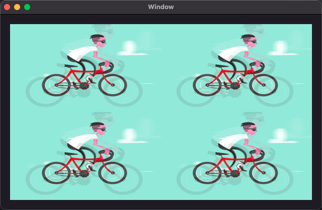
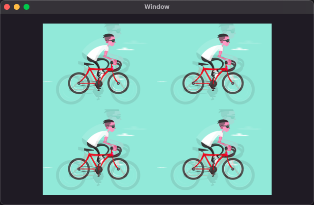
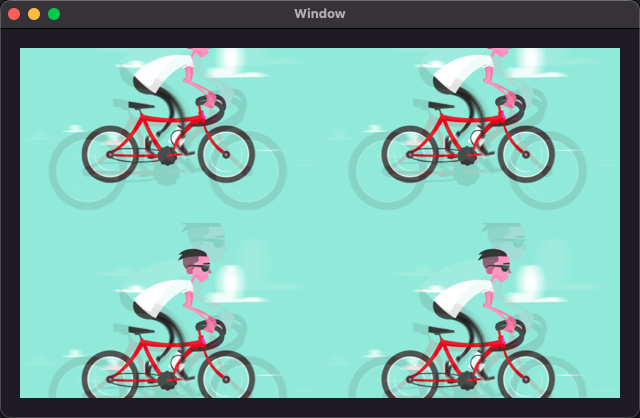
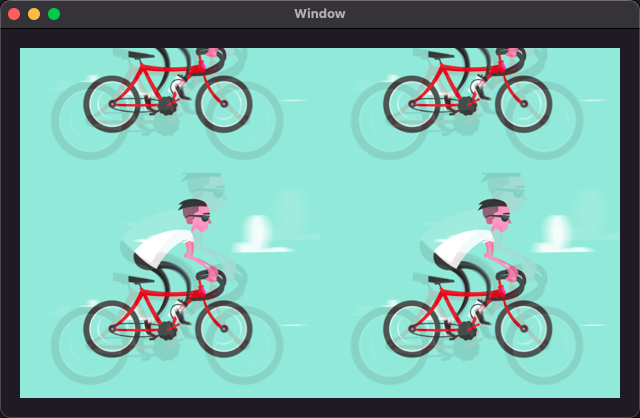
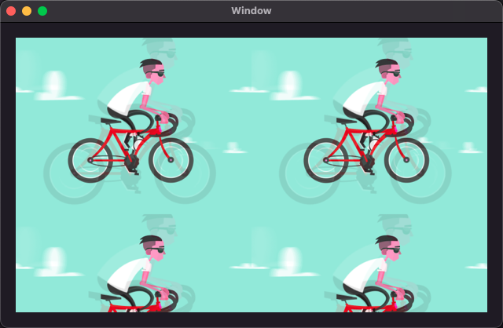

# Wintersweet

[](https://github.com/yangKJ/Wintersweet)
[](https://cocoapods.org/pods/Wintersweet)


[**Wintersweet**](https://github.com/yangKJ/Wintersweet)是一款快速让控件播放GIF和添加滤镜的框架，核心其实就是使用[**CADisplayLink**](https://github.com/yangKJ/Harbeth/blob/master/Sources/Basic/Setup/DisplayLink.swift)不断刷新和更新GIF帧图。

-------

[**English**](README.md) | 简体中文

### 功能

- 支持全平台系统，macOS、iOS、tvOS、watchOS；
- 支持播放本地和网络GIF动画；
- 支持`NSImageView`或`UIImageView`显示网络图像或GIF并添加 [**Harbeth**](https://github.com/yangKJ/Harbeth) 滤镜；
- 支持任何控件并使用协议 [**AsAnimatable**](https://github.com/yangKJ/Wintersweet/blob/master/Sources/AsAnimatable.swift) 即可快速达到支持播放GIF功能；
- 支持六种 [**ContentMode**](https://github.com/yangKJ/Wintersweet/blob/master/Sources/Core/ContentMode.swift) 内容填充模式；
- 支持缓存 [**Cached**](https://github.com/yangKJ/Wintersweet/blob/master/Sources/Core/Cached.swift) 网络GIF数据；

------

### 简单使用

1. `NSImageView`或`UIImageView`显示网络图像或GIF并添加过滤器。

```swift
let links = [``GIF Link URL``, ``Picture Link URL``]
let URL = URL(string: links.randomElement() ?? "")!
var options = AnimatedOptions(contentMode: .scaleAspectBottomRight)
options.setAnimated { loopDuration in
    // do something..
}
imageView.mt.displayImage(url: URL, filters: filters, options: options)

-----------------------------------------------------------------------------------
😘😘 其他方法:

/// 根据名称显示图像或GIF并添加过滤器
public func displayImage(named: String, filters: [C7FilterProtocol], options: AnimatedOptions = .default)

/// 显示数据源data图像或GIF并添加过滤器
public func displayImage(data: Data?, filters: [C7FilterProtocol], options: AnimatedOptions = .default) -> AssetType

/// 显示网络图像或GIF并添加过滤器
public func displayImage(url: URL, filters: [C7FilterProtocol], options: AnimatedOptions = .default, failed: FailedCallback? = nil) -> URLSessionDataTask?
```

2. 任意控件实现协议`AsAnimatable`均可立刻支持GIF播放，核心其实就是在`layer.contents`显示帧图。

```swift
/// 任意控件实现协议``AsAnimatable``均可支持GIF播放
class GIFView: UIView, AsAnimatable {
    ...
}

lazy var animatedView: GIFView = {
    let view = GIFView.init(frame: .zero)
    view.translatesAutoresizingMaskIntoConstraints = false
    view.layer.contentsGravity = .resizeAspect
    view.backgroundColor = UIColor.red.withAlphaComponent(0.3)
    return view
}()

let filters: [C7FilterProtocol] = [ ``Harbeth Filter`` ]
let data = AnimatedOptions.gifData("cycling")
let options = AnimatedOptions.init(loop: .count(5))
animatedView.play(data: data, filters: filters, options: options)
```

### AsAnimatable

- 只要遵循实现过该协议，即可使用播放GIF动画功能，简简单单！

```
public protocol AsAnimatable: HasAnimatable {    
    /// 动画循环的总持续时间
    var loopDuration: TimeInterval { get }
    
    /// 当前活动GIF帧图
    var activeFrame: C7Image? { get }
    
    /// GIF的总帧数
    var frameCount: Int { get }
    
    /// 是否为GIF
    var isAnimatingGIF: Bool { get }
    
    /// 位图内存成本，单位字节
    var cost: Int { get }
    
    /// 停止动画并从内存中释放GIF数据
    func prepareForReuseGIF()
    
    /// 开启GIF动画
    func startAnimatingGIF()
    
    /// 停止GIF动画
    func stopAnimatingGIF()

    /// 准备动画并开始播放GIF
    /// - Parameters:
    ///   - data: GIF数据源
    ///   - filters: Harbeth滤镜添加到GIF帧图
    ///   - options: 使用的GIF播放创建其他参数选项
    func play(data: Data?, filters: [C7FilterProtocol], options: AnimatedOptions)
}
```

### ContentMode

- 主要用于图像填充内容更改大小

```
public enum ContentMode {
    /// 原始图像的尺寸
    case original
    /// 必要时通过更改内容的宽高比来缩放内容以适应自身大小的选项
    case scaleToFill
    /// 内容缩放以适应固定方面。其余部分是透明的
    case scaleAspectFit
    /// 内容缩放以填充固定方面。内容的某些部分可能会被剪切.
    case scaleAspectFill
    /// 内容缩放以填充固定方面。内容的顶部或左侧可以裁剪.
    case scaleAspectBottomRight
    /// 内容缩放以填充固定方面。内容的底部或右侧部分可以裁剪
    case scaleAspectTopLeft
}
```

- scaleToFill: 拉升图片来适应控件尺寸，图像会变形；

<p align="left">

</p>

- scaleAspectFit: 保持图像宽高比例，适应控件最大尺寸；

<p align="left">

</p>

- scaleAspectFill: 保持图像宽高比，取图像最小边显示，多余四周部分将被裁减；

<p align="left">

</p>

- scaleAspectBottomRight: 保持图像宽高比，取图像最小边显示，多余顶部或左侧部分将被裁减；

<p align="left">

</p>

- scaleAspectTopLeft: 保持图像宽高比，取图像最小边显示，多余底部或右侧部分将被裁减；

<p align="left">

</p>

### Cached

- 网络数据缓存类型

```
/// 禁用内存缓存读取
public static let disableMemoryCacheReads = Options(rawValue: 1 << 0)
/// 禁用内存缓存写入
public static let disableMemoryCacheWrites = Options(rawValue: 1 << 1)
/// 读写内存缓存
public static let usedMemoryCache = Options(rawValue: 1 << 2)
/// 禁用内存缓存读取和写入
public static let disableMemoryCache: Options = [.disableMemoryCacheReads, .disableMemoryCacheWrites]
```

### Loop

- GIF循环次数

```
public enum Loop {
    /// 无限循环
    case forever
    /// 循环播放一次
    case never
    /// 循环播放指定``count``次
    case count(_ count: Int)
}
```

### 关于作者
- 🎷 **邮箱地址：[ykj310@126.com](ykj310@126.com) 🎷**
- 🎸 **GitHub地址：[yangKJ](https://github.com/yangKJ) 🎸**
- 🎺 **掘金地址：[茶底世界之下](https://juejin.cn/user/1987535102554472/posts) 🎺**
- 🚴🏻 **简书地址：[77___](https://www.jianshu.com/u/c84c00476ab6) 🚴🏻**

🫰.

- 觉得有帮助的铁子，就给我点个星🌟支持一哈，谢谢铁子们～

-----
