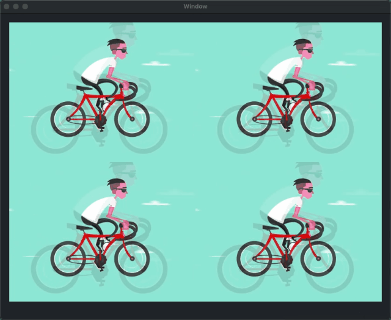

# Wintersweet

<p align="center">

</p>

[**Wintersweet**](https://github.com/yangKJ/Wintersweet)是一款快速让控件播放GIF和添加过滤器的框架，核心其实就是使用[**CADisplayLink**](https://github.com/yangKJ/Harbeth/blob/master/Sources/Basic/Setup/DisplayLink.swift)不断刷新和更新GIF帧。

-------

[**English**](README.md) | 简体中文

### 功能

- 支持全平台系统，macOS、iOS、tvOS、watchOS。
- 支持添加 [**Harbeth**](https://github.com/yangKJ/Harbeth) 滤镜到GIF中播放。
- 支持播放本地和网络GIF动画。
- 支持任何控件并使用协议 [**AsAnimatable**](https://github.com/yangKJ/Wintersweet/blob/master/Sources/AsAnimatable.swift) 即可快速达到支持播放GIF功能。
- 支持六种 [**ContentMode**](https://github.com/yangKJ/Wintersweet/blob/master/Sources/Core/ContentMode.swift) 内容填充模式。
- 支持内存缓存 [**Cached**](https://github.com/yangKJ/Wintersweet/blob/master/Sources/Core/Cached.swift) 网络GIF数据。

------

### 简单使用

1. 使用本地gif

```
func setup(imageName: String) {
    guard let imagePath = Bundle.main.url(forResource: imageName, withExtension: "gif"),
          let data = try? Data(contentsOf: imagePath) else {
        return
    }
    let filters: [C7FilterProtocol] = [
        C7SoulOut(soul: 0.75),
        C7ColorConvert(with: .rbga),
        C7Storyboard(ranks: 2),
    ]
    imageView.play(withGIFData: data, filters: filters, preparation: {
        // do something..
    })
}
```

2. 使用网络gif

```
func setupNetworkGif() {
    let URL = URL(string: ``URL Link``)!
    animatedView.play(withGIFURL: URL, filters: [
        C7WhiteBalance(temperature: 5555),
        C7LookupTable(image: R.image("lut_x"))
    ], loop: .count(5), cacheOption: Cached.Options.usedMemoryCache)
}
```

3. 任意控件实现协议``AsAnimatable``均可支持GIF播放

```
class GIFView: UIView, AsAnimatable {
    
}
```

**这边已经对``ImageView``实现GIF动态图支持，so 直接使用即可。✌️**

### AsAnimatable

- 只要遵循实现过该协议，即可使用播放GIF动画功能，简简单单！

```
public protocol AsAnimatable: HasAnimatable {    
    /// 动画循环的总持续时间
    var loopDuration: TimeInterval { get }
    
    /// 当前活动GIF帧图
    var activeFrame: C7Image? { get }
    
    /// GIF的总帧数
    var frameCount: Int { get }
    
    /// 是否为GIF
    var isAnimatingGIF: Bool { get }
    
    /// 计算此GIF的帧大小
    var gifSize: Int { get }
    
    /// 停止动画并从内存中释放GIF数据
    func prepareForReuseGIF()
    
    /// 开启GIF动画
    func startAnimatingGIF()
    
    /// 停止GIF动画
    func stopAnimatingGIF()
}
```

对外开放两个播放GIF方法：

```
/// 准备动画并开始播放GIF
/// - Parameters：
///   - withGIFData：GIF图像数据。
///   - filters：Harbeth过滤器适用于GIF帧。
///   - loop：所需的循环数量。默认值为``forever``。
///   - contentMode：用于调整帧大小的内容模式。默认值为``original``。
///   - bufferCount：要缓冲的帧数。默认值为50。高数字将导致更多的内存使用和更少的CPU负载，反之亦然。
///   - preparation：准备播放时间回调。
///   - animated：播放GIF完成回调。
public func play(withGIFData data: Data,
                 filters: [HFilter],
                 loop: Wintersweet.Loop = .forever,
                 contentMode: Wintersweet.ContentMode = .original,
                 bufferCount: Int = 50,
                 preparation: PreparationCallback? = nil,
                 animated: AnimatedCallback? = nil) {
    ...
}

/// 准备动画并开始播放GIF。
/// - Parameters：
///   - withGIFURL：GIF图像网址。
///   - filters：Harbeth过滤器适用于GIF帧。
///   - loop：所需的循环数量。默认值为``forever``。
///   - contentMode：用于调整帧大小的内容模式。默认值为``original``。
///   - cacheOption：无论天气与否，我们都应该缓存URL响应。默认值为``disableMemoryCache``。
///   - bufferCount：要缓冲的帧数。默认值为50。高数字将导致更多的内存使用和更少的CPU负载，反之亦然。
///   - preparation：准备播放时间回调。
///   - animated：播放GIF完成回调。
///   - failed：网络失败回调。
public func play(withGIFURL: URL,
                 filters: [HFilter],
                 loop: Wintersweet.Loop = .forever,
                 contentMode: Wintersweet.ContentMode = .original,
                 cacheOption: Wintersweet.Cached.Options = .disableMemoryCache,
                 bufferCount: Int = 50,
                 preparation: PreparationCallback? = nil,
                 animated: AnimatedCallback? = nil,
                 failed: FailedCallback? = nil) {
    ...
}
```

### ContentMode

- 主要用于图像填充内容更改大小

```
public enum ContentMode {
    /// 原始图像的尺寸。不要用它做任何事情
    case original
    /// 必要时通过更改内容的宽高比来缩放内容以适应自身大小的选项
    case scaleToFill
    /// 内容缩放以适应固定方面。其余部分是透明的
    case scaleAspectFit
    /// 内容缩放以填充固定方面。内容的某些部分可能会被剪切.
    case scaleAspectFill
    /// 内容缩放以填充固定方面。内容的顶部或左侧可以裁剪.
    case scaleAspectBottomRight
    /// 内容缩放以填充固定方面。内容的底部或右侧部分可以裁剪
    case scaleAspectTopLeft
}
```

- scaleToFill: 拉升图片来适应控件尺寸，图像会变形；

<p align="left">

</p>

- scaleAspectFit: 保持图像宽高比例，适应控件最大尺寸；

<p align="left">

</p>

- scaleAspectFill: 保持图像宽高比，取图像最小边显示，多余四周部分将被裁减；

<p align="left">

</p>

- scaleAspectBottomRight: 保持图像宽高比，取图像最小边显示，多余顶部或左侧部分将被裁减；

<p align="left">

</p>

- scaleAspectTopLeft: 保持图像宽高比，取图像最小边显示，多余底部或右侧部分将被裁减；

<p align="left">

</p>

### Cached

- 网络数据缓存类型

```
/// 禁用内存缓存读取
public static let disableMemoryCacheReads = Options(rawValue: 1 << 0)
/// 禁用内存缓存写入
public static let disableMemoryCacheWrites = Options(rawValue: 1 << 1)
/// 读写内存缓存
public static let usedMemoryCache = Options(rawValue: 1 << 2)
/// 禁用内存缓存读取和写入
public static let disableMemoryCache: Options = [.disableMemoryCacheReads, .disableMemoryCacheWrites]
```

### Loop

- GIF循环次数

```
public enum Loop {
    /// 无限循环
    case forever
    /// 循环播放一次
    case never
    /// 循环播放指定``count``次
    case count(_ count: Int)
}
```

-----

> 外部需要使用到的类和协议先简单介绍出来，关于内部使用到的类和协议后续再慢慢介绍！！  
> 
> 觉得有帮助的铁子，就给我点个星🌟支持一哈，谢谢铁子们～  
> 有什么问题也可以直接联系我，邮箱[yangkj310@gmail.com](yangkj310@gmail.com)

### 关于作者
- 🎷 **邮箱地址：[ykj310@126.com](ykj310@126.com) 🎷**
- 🎸 **GitHub地址：[yangKJ](https://github.com/yangKJ) 🎸**
- 🎺 **掘金地址：[茶底世界之下](https://juejin.cn/user/1987535102554472/posts) 🎺**
- 🚴🏻 **简书地址：[77___](https://www.jianshu.com/u/c84c00476ab6) 🚴🏻**

🫰.

-----
